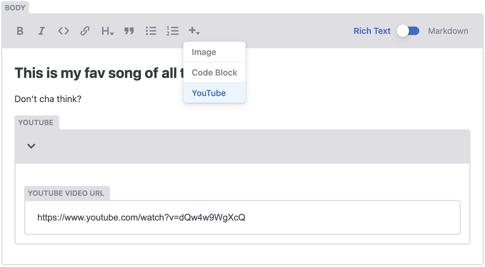

In one of the websites I have built, I needed to be able to embed YouTube videos in the markdown content of the blog posts. I am using [Gatsby](https://www.gatsbyjs.com/) together with [NetlifyCMS](https://www.netlifycms.org/).

Two are the things that I had to figure out:

1. How do I represent the YouTube video in markdown so that the `gatsby-transformer-remark` plugin (which is responsible for converting markdown to HTML) can render it? Bonus: How do I make sure that the iframe of the embedded videos is responsive and looks good on mobile devices?
2. How do I extend NetlifyCMS' markdown widget to support adding YouTube links in the content, without forcing the user to switch to the markdown view?

## The Gatbsy part

Thankfully, Gatsby's ecosystem is huge! From Gatsby's [Working with Video](https://www.gatsbyjs.com/docs/how-to/images-and-media/working-with-video/) guide, I discovered the [`gatsby-remark-embed-video`](https://www.gatsbyjs.com/plugins/gatsby-remark-embed-video/) plugin. This allows me to represent a YouTube video in markdown as a simple code block:

```
`youtube: https://www.youtube.com/watch?v=dQw4w9WgXcQ`
```

Simply install the plugin and include it in the list of plugins in `gatsby-config.js`:

```
yarn add gatsby-remark-embed-video
```

To ensure that the video will be responsive, use the `gatsby-remark-responsive-iframe` plugin and place it **after** the `gatsby-remark-embed-video` one, as [recommended](https://www.gatsbyjs.com/plugins/gatsby-remark-embed-video/?=video#install) by the plugin's author:

```js
module.exports = {
  plugins: [
    {
      resolve: `gatsby-transformer-remark`,
      options: {
        plugins: [
          `gatsby-remark-embed-video`,
          `gatsby-remark-images`,
          `gatsby-remark-responsive-iframe`,
        ],
      },
    },
  ],
}
```

You can now add a YouTube video in your markdown file and Gatsby will know how to render it. Your markdown file should look something like this:

```markdown
---
title: "Here is a blog post with a YouTube video"
date: "2020-06-03"
---

## This is my fav song of all times

Don't cha think?

`youtube: https://www.youtube.com/watch?v=dQw4w9WgXcQ`
```

## The NetlifyCMS part

Great, now all we need is to figure out how to extend NetlifyCMS' markdown widget to be able to add code blocks like the above to our markdown content. Checking out the [official documentation of the markdown widget](https://www.netlifycms.org/docs/widgets/#markdown) I discovered the guide about [Creating Custom Widgets](https://www.netlifycms.org/docs/custom-widgets/#registereditorcomponent) and specifically the `registerEditorComponent` method. And hey, what luck, there is an actual example of registering an editor component for adding YouTube videos! Today is a good day.

The question now is, where do I add the code to call this method? I am simply using the `gatsby-plugin-netlify-cms` plugin in my `gatsby-config.js` like so:

```js
module.exports = {
  plugins: [`gatsby-plugin-netlify-cms`],
}
```

Diving into the [documentation of the plugin](https://www.gatsbyjs.com/plugins/gatsby-plugin-netlify-cms/#options), I discovered the `modulePath` option which lets me specify a path to a file where I can import the `CMS` object. Sweet!

Update your configuration to:

```js
module.exports = {
  plugins: [
    {
      resolve: `gatsby-plugin-netlify-cms`,
      options: {
        modulePath: `${__dirname}/src/cms.js`,
      },
    },
  ],
}
```

and create the `cms.js` file in the `/src` directory (feel free to place it wherever you want as long as you link it properly in the `gatsby-config.js` file):

```js
import CMS from "netlify-cms-app"

CMS.registerEditorComponent({
  id: "youtube",
  label: "YouTube",
  fields: [
    {
      name: "url",
      label: "Youtube video URL",
      widget: "string",
    },
  ],
  pattern: /^`youtube:\s(.*)`$/,
  fromBlock: function (match) {
    return {
      url: match[1],
    }
  },
  toBlock: function (obj) {
    return "`youtube: " + obj.url + "`"
  },
  toPreview: function (obj) {
    return obj.url
  },
})
```

To explain what's going on above:

- The `pattern` attribute defines the regular expression that will look for the line in the markdown content that starts with the string "`youtube: " and catch anything that comes after it, which in our case is the link to the video.
- The `fromBlock` attribute defines a function that is responsible to initialize the value of the rendered widget. In other words, it takes the link of the video from the `pattern` and adds it in the input field of the YouTube widget.
- The `toBlock` function defines the representation of the YouTube video in the markdown content. To comply with the `gatsby-remark-embed-video` Gatsby plugin, this needs to be a line that starts with a backtick, followed by the word "youtube: ", followed by the video link, and ends with another backtick.

That's it! You can now go to your CMS page, click the "+" icon in the markdown editor, select "YouTube", paste your YouTube link and save your blog post.



## But what about Vimeo and VideoPress?

The `gatsby-remark-embed-video` plugin supports [multiple video hosting services](https://www.gatsbyjs.com/plugins/gatsby-remark-embed-video/#usage) like Vimeo and VideoPress, not just YouTube (it also says it supports Twitch and Twitch live, but I couldn't manage to make it work). Simply replace the instances of `youtube` with `video` in the `cms.js` file to support them!
