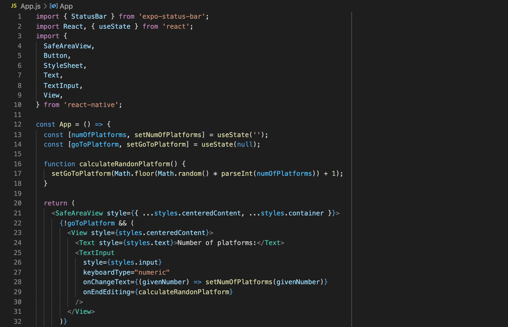

This morning I challenged myself to see how difficult it would be to have a running Android app installed on my phone, starting from scratch. I wanted a simple app that given a number it would calculate a random integer number between 1 and the number I provided. I wanna use it for performing a "random walk" using the train system of Switzerland to explore the country. I know, silly, but why not.

## Setting up the dev environment

I started by googling "React Native". Headed to the [official website](https://reactnative.dev/). I read through the home page, run the command to start a new project, and went on to [read the basics](https://reactnative.dev/docs/tutorial) and the [getting started guide](https://reactnative.dev/docs/getting-started).

```
$ npx react-native init MyTestApp
```

The first thing I saw in the [getting started guide](https://reactnative.dev/docs/getting-started) is that I need to set up my dev environment. Since I am not familiar with mobile development, I decided to start with Expo CLI instead of the React Native CLI (which is what I used above to set up my first project). This [SO thread](https://stackoverflow.com/questions/39170622/what-is-the-difference-between-expo-and-react-native) describes well the differences between the 2 cli's.

Simply following the [Expo CLI Quickstart guide](https://reactnative.dev/docs/environment-setup) didn't work. I installed the global expo-cli package, initialized a new project, started the development server, installed the [Expo Go Android app](https://play.google.com/store/apps/details?id=host.exp.exponent&hl=en&gl=US) on my phone, connected both my laptop and my phone on the same WiFi, but there was no QR code on my terminal to scan with the Expo Go app.

```bash
$ yarn global add expo-cli
...
success Installed "expo-cli@4.4.7" with binaries:
      - expo
      - expo-cli
✨  Done in 65.40s.
```

```bash
$ expo init AwesomeProject
✔ Choose a template: › minimal               bare and minimal, just the essentials to get you started
✔ Downloaded and extracted project files.
🧶 Using Yarn to install packages. Pass --npm to use npm instead.
✔ Installed JavaScript dependencies.
```

```bash
$ cd AwesomeProject
$ yarn start
yarn run v1.22.10
$ react-native start

               ######                ######
             ###     ####        ####     ###
            ##          ###    ###          ##
            ##             ####             ##
            ##             ####             ##
            ##           ##    ##           ##
            ##         ###      ###         ##
             ##  ########################  ##
          ######    ###            ###    ######
      ###     ##    ##              ##    ##     ###
   ###         ## ###      ####      ### ##         ###
  ##           ####      ########      ####           ##
 ##             ###     ##########     ###             ##
  ##           ####      ########      ####           ##
   ###         ## ###      ####      ### ##         ###
      ###     ##    ##              ##    ##     ###
          ######    ###            ###    ######
             ##  ########################  ##
            ##         ###      ###         ##
            ##           ##    ##           ##
            ##             ####             ##
            ##             ####             ##
            ##          ###    ###          ##
             ###     ####        ####     ###
               ######                ######

                 Welcome to React Native!
                Learn once, write anywhere

To reload the app press "r"
To open developer menu press "d"
```

Next idea was to learn more about how this expo thing works. Going on [Expo's website](https://expo.io/), clicking [Get Started](https://docs.expo.io/), moving to the [installation guide](https://docs.expo.io/get-started/installation/) and finally to the [Create a new app guide](https://docs.expo.io/get-started/create-a-new-app/) I found the command that displayed the QR code on my screen:

```bash
$ expo start
```

Scanning the QR code with the [Expo Go app](https://play.google.com/store/apps/details?id=host.exp.exponent&hl=en&gl=US) on my Android phone opened up the app on my phone. Editing the source code on my laptop changes quickly refreshes the app on my phone. Nice! The whole process took a bit less than 1.5h 🤦‍♂️ But whatever, we're moving!

## Coding the app

Without having much experience with React, I managed to code the simple concept of an app that I mentioned earlier by simply reading the [Introduction](https://reactnative.dev/docs/getting-started), [Core Components and Native Components](https://reactnative.dev/docs/intro-react-native-components), [React Fundamentals](https://reactnative.dev/docs/intro-react) and [Handling Text Input](https://reactnative.dev/docs/handling-text-input) React Native guides. Great, the app seems to be working on the dev environment, let's compile it and install it on my phone, I said.

## Compiling the app

Initially, I was planning on releasing the app on the Google Play Store and thus started by following the [Publishing to Google Play Store guide](https://reactnative.dev/docs/signed-apk-android) of the React Native documentation. I installed the latest Java JDK, generated a private signing key, set up the Grandle variables, added the signing configuration to my app's Grandle config file only to realize that the Google Play store required a \$25 fee for registering. I decided to postpone it for the day that I'll actually have a useful app I'd like to share with the world 😅

I moved on with generating the Android App Bundle with:

```bash
$ cd android
$ ./gradlew bundleRelease
```

but I received the error

```bash
General error during semantic analysis: Unsupported class file major version 60
```

The reason is that the Grandle 6.8 version that my app is using does not support the latest Java JDK (16). Someone [commented literally 11 hours ago](https://github.com/gradle/gradle/issues/13629#issuecomment-844561525) that Gradle 7.0 fully supports Java 16, so I upgraded Grandle by simply changing the version in the file `android/gradle/wrapper/gradle-wrapper.properties`, but now I got [a new error](https://github.com/expo/expo/issues/12774) after running the above command:

```
Plugin with id ‘maven’ not found
```

Decided to downgrade to Java 11:

```
$ brew install java11
$ echo 'export PATH="/usr/local/opt/openjdk@11/bin:$PATH"' >> ~/.zshrc
$ export CPPFLAGS="-I/usr/local/opt/openjdk@11/include"
$ source ~/.zshrc
```

but then I got yet another error:

```
Could not determine the dependencies of task ':app:bundleReleaseResources'.
> SDK location not found. Define location with an ANDROID_SDK_ROOT environment variable or by setting the sdk.dir path in your project's local properties file at '.../android/local.properties'.
```

After some googling on how to install the Android SDK (since [the one I found in Homebrew](https://formulae.brew.sh/cask/android-sdk) is deprecated), I decided to install the [Android Studio](https://formulae.brew.sh/cask/android-studio).

```bash
$ brew install --cask android-studio
```

I opened the application to download and install all necessary packages for Android development, including the Android SDK.

But we're not done with errors apparently:

```
> Failed to install the following Android SDK packages as some licences have not been accepted.
```

To fix this, I [installed the Android SDK command line tool](https://stackoverflow.com/questions/54273412/failed-to-install-the-following-android-sdk-packages-as-some-licences-have-not/66392874):

1. Opened Android Studio
2. Went to SDK manager
3. Clicked on SDK tools tab
4. Installed Android SDK command line tool

For one last time, I run the build command and it finally worked:

```bash
$ ./gradlew bundleRelease
...
BUILD SUCCESSFUL in 3m 14s
494 actionable tasks: 494 executed
```

## Installing the app on my Android phone

The last step of my challenge was to install the app on my phone. I figured the easiest way would be to move the output APK to my phone via USB. And so I did by installing and using the [Android File Transfer](https://formulae.brew.sh/cask/android-file-transfer) app.

## Conclusion

A few years back I was extremely hesitant and scared of even attempting to create a native app of my own. My impostor syndrome was hitting me hard every time I was facing a problem. An inner voice was judging me that I am not good enough and that I should not even try. If you are stuck in a similar situation, I hope that this blog post will unblock you from a potential roadblock you're facing. Keep believing in your skill to learn. Not in your dev skills. It might have taken me 5 hours to simply set up a dev environment, code a simple app and figure out how to compile it and install it, but I did it. And so can you.
