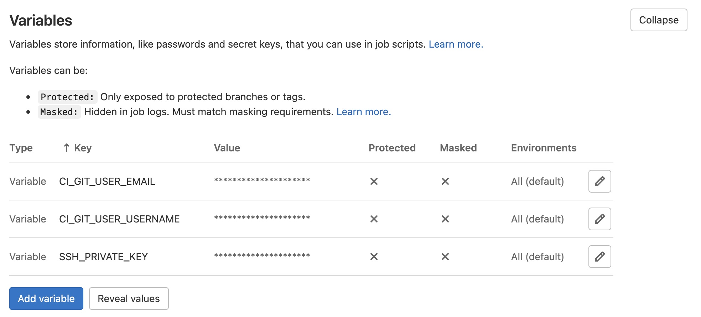
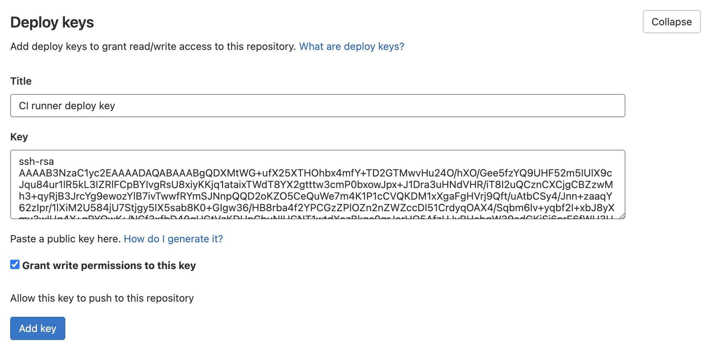
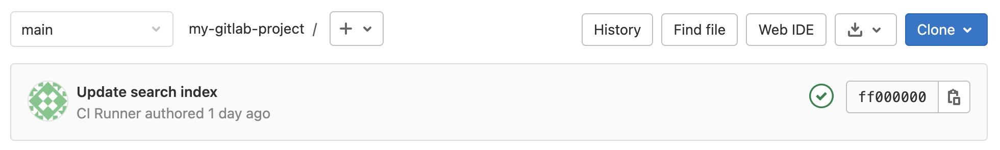

Last week I implemented a search functionality for a static website with [Lunr.js](https://lunrjs.com/). The way I implemented the search system, depends on 2 files to work, the `pagesData.json` and the `searchIndex.json`. These 2 files get generated by running an npm script (I called it `yarn createSearchIndex`) which will parse all markdown files of the static website (pages and blog posts) and create the 2 aforementioned files. Obviously, I do not want to be responsible for running this script on my machine every time someone publishes a new blog post through our CMS (we use [NetlifyCMS](https://www.netlifycms.org/), so when someone wants to create a new blog post, they simply log in into the CMS, create the blog post, and the CMS will create a new commit on the branch NetlifyCMS connected to). What I want is the following:

- User commits a new blog post in branch `main`
- A GitLab CI pipeline is triggered, which runs the `yarn createSearchIndex` script, which in turn generates the new `pagesData.json` and the `searchIndex.json` files
- GitLab CI commits the new `pagesData.json` and `searchIndex.json` files without triggering a new CI pipeline

## Allowing GitLab runner to push to the git repo

We need to ensure that the GitLab runner machine can push new changes to our repository, so we need to have an SSH key and a git user.

### Create SSH key pair

Create a public (`deploy_key.pub`) and private (`deploy_key`) SSH key pair without a passphrase with:

```
ssh-keygen -f deploy_key -N ""
```

### Create environment variables

In the `settings/ci_cd` page of your GitLab project, define 3 environment variables:

- `CI_GIT_USER_EMAIL` with the email of the git user that will appear in the commits made by the GitLab runner
- `CI_GIT_USER_USERNAME` with the name of the git user that will appear in the commits made by the GitLab runner
- `SSH_PRIVATE_KEY` with the contents of the private SSH key (you can copy the contents with `pbcopy < deploy_key`)



### Create deploy key

In the `settings/repository` page of the GitLab project we need to create a **deploy key**. Create a new deploy key and paste the contents of the previously generated public key (`pbcopy < deploy_key.pub`).

Make sure to enable _Grant write permissions to this key_, otherwise the runner won't be able to push new commits.



### Write .gitlab-ci.yml file

A basic version of my `.gitlab-ci.yml` file looks like this:

```yaml
image: node:14

stages:
  - commit

update-index:
  stage: commit
  before_script:
    # Set up the SSH key and the known_hosts file
    - "which ssh-agent || ( apt-get update -y && apt-get install openssh-client -y )"
    - eval $(ssh-agent -s)
    - echo "${SSH_PRIVATE_KEY}" | tr -d '\r' | ssh-add - > /dev/null
    - mkdir -p ~/.ssh
    - ssh-keyscan my.selfhostedgitlab.com >> ~/.ssh/known_hosts
  script:
    # Configure git
    - git config --global user.email "${CI_GIT_USER_EMAIL}"
    - git config --global user.name "${CI_GIT_USER_USERNAME}"
      # Cone git repo
    - git clone git@my.selfhostedgitlab.com:${CI_PROJECT_PATH}.git
    - cd ${CI_PROJECT_NAME}
    - git checkout main
      # run scripts to generate new pagesData.json and searchIndex.json
    - yarn && yarn createSearchIndex
      # Check if there is something to commit, commit files, and push
    - |
      if [[ -n $(git status --porcelain) ]]; then
        git add src/pagesData.json src/searchindex.json &&
        git commit -m "Update search index" &&
        git push origin main -o ci.skip
      fi
  only:
    - main
```

Make sure to add the `-o ci.skip` flag in the `git push` command, so that you don't trigger another pipeline.

The commit should then appear, with the name of the git user you have configured:



## Resources

These resources helped me figure it out:

- https://forum.gitlab.com/t/git-push-from-inside-a-gitlab-runner/30554
- https://about.gitlab.com/blog/2017/11/02/automating-boring-git-operations-gitlab-ci/
- https://marcosschroh.github.io/posts/autobumping-with-gitlab/
- https://forum.gitlab.com/t/is-it-possible-to-commit-artifacts-into-the-git/22218/7
