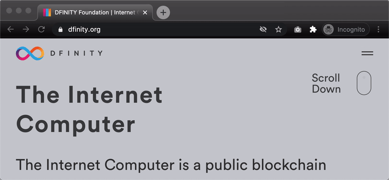

This tutorial demonstrates the integration of Vue.js with the [default project of the DFINITY SDK][docs], as a result of a fun hackathon between friends.



## Creating an Internet Computer application project

Create a simple webpack project using the `dfx` tool:

```bash
dfx new dfinity_vue
cd dfinity_vue
```

If you prefer using `yarn`, delete the `package-lock.json` file and run `yarn` to create a `yarn.lock` file.

```bash
yarn && rm package-lock.json
```

## Integrating Vue

### Installing packages

Since the DFINITY Canister Software Development Kit (SDK) already uses webpack, we have to install Vue from npm (instead of using the [`vue-cli` tool][3]). To do that, simply install the [`vue` package][1]:

```bash
yarn add vue
```

Install [`vue-loader`][2] so that webpack can load `.vue` files, unless you are not planning on using [Single File Components][5].

```bash
yarn add --dev vue-loader
```

When using `vue-loader` you will also need [`vue-template-compiler`][4] to avoid runtime-compilation overhead and CSP restrictions.

```bash
yarn add --dev vue-template-compiler
```

If you miss this part, you'll receive this error message:

```
[vue-loader] vue-template-compiler must be installed as a peer dependency, or a compatible compiler implementation must be passed via options.
```

### Create Vue instance and component

Now that we have all the packages that we need we can update the `src/dfinity_vue_assets/public/index.js` file to use Vue. Replace the contents of the file with:

```js
import Vue from "vue";
import App from "./App.vue";

new Vue({
  render: (h) => h(App),
}).$mount("#app");
```

and create the `src/dfinity_vue_assets/public/App.vue` component with the following contents:

```js
<template>
  <div id="app">
    <div>{{ greeting || 'Loading message from Internet Computer...' }}</div>
  </div>
</template>

<script>
import dfinity_vue from 'ic:canisters/dfinity_vue';

export default {
  data: () => {
    return {
      greeting: ''
    };
  },
  created() {
    dfinity_vue.greet(window.prompt("Enter your name:")).then(greeting => {
      this.greeting = greeting
    });
  }
}
</script>
```

The above component will call the `greet` method of the `dfinity_vue` canister passing the user's input as an argument and render the response on the DOM.

## Deploying on the local Internet Computer network

Start a local Internet Computer network:

```bash
dfx start
```

Register all canisters:

```bash
dfx canister create --all
```

The above command will return an output similar (if not the same) to this:

```
Creating canister "dfinity_vue"...
"dfinity_vue" canister created with canister id: "rwlgt-iiaaa-aaaaa-aaaaa-cai"
Creating canister "dfinity_vue_assets"...
"dfinity_vue_assets" canister created with canister id: "rrkah-fqaaa-aaaaa-aaaaq-cai"
```

Note the id of the `dfinity_vue_assets` canister (in this case: `rrkah-fqaaa-aaaaa-aaaaq-cai`). You'll need it soon.

Build all canisters:

```bash
dfx build
```

Deploy all canisters on the local network:

```bash
dfx canister install --all
```

Pass the `dfinity_vue_assets` canister id as an argument to https://localhost:8000/?canisterId=rrkah-fqaaa-aaaaa-aaaaq-cai and browse your application.

## Tips

After you make changes to the frontend code, redeploy only the frontend canister with:

```bash
dfx build dfinity_vue_assets && dfx canister install dfinity_vue_assets --mode upgrade
```

[1]: https://vuejs.org/v2/guide/installation.html#NPM
[2]: https://vue-loader.vuejs.org/#what-is-vue-loader
[3]: https://github.com/vuejs/vue-cli
[4]: https://www.npmjs.com/package/vue-template-compiler
[5]: https://vuejs.org/v2/guide/single-file-components.html
[docs]: https://sdk.dfinity.org/docs/developers-guide/tutorials/explore-templates.html

## Conclusion

Life should be easy peasy lemon squeezy. Not stressed depressed lemon zest. Integrating Vue.js in this case is a good example of the former 😊

You can find this project on GitHub: https://github.com/nop33/dfinity-vue

Continue to learn how to integrate Vuetify in the [Part 2 blog post](/integrating-vuetify-dfinity-sdk).
