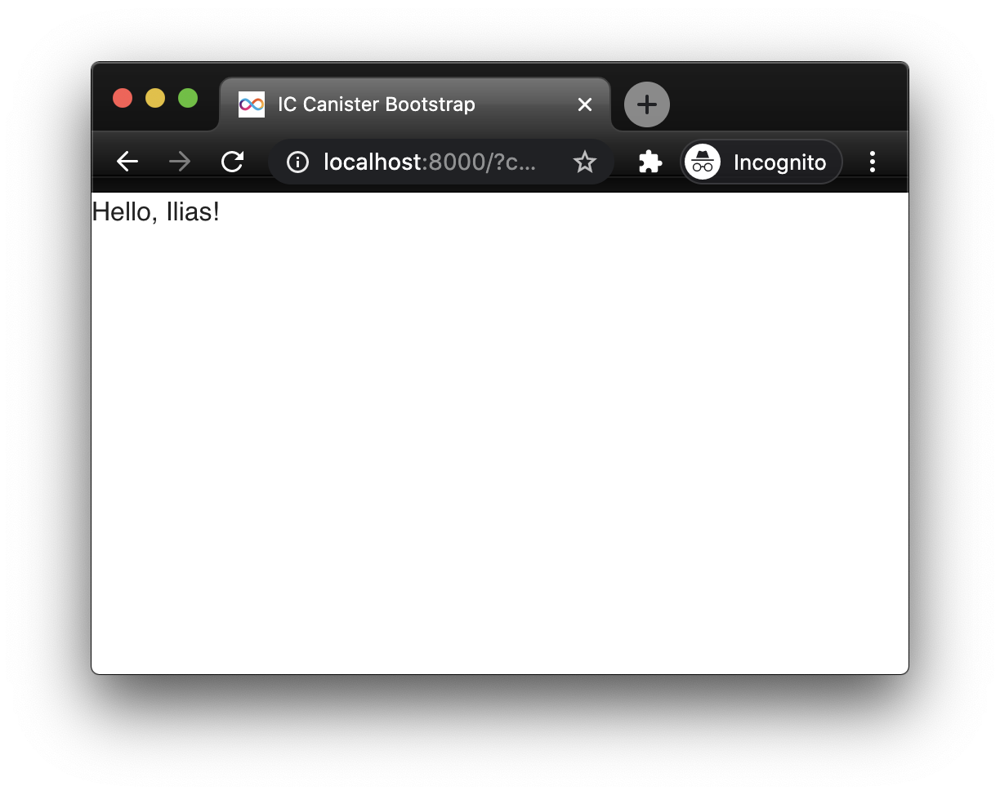

Let's extend the app we built in the [first tutorial](/integrating-vue-dfinity-sdk) on how to integrate Vue.js and make use of the [Vuetify][vuetify] UI framework. It is a great option when you want to get started building your app without having to worry about CSS. You can simply use Google's Material Design guidelines embeded in premade Vue components ready to use in your Vue app. Sweet.

## Installing Vuetify

First of all, add the `vuetify` npm package to your project as a dependency (not a dev dependency, we actually need code of the package in our production app):

```sh
yarn add vuetify
```

This gives us access to Vuetify's Vue components and styles. In order to make use of the styles however, we need the appropriate webpack loaders.

I find the [Vuetify webpack installation docs][vuetify-docs] very confusing. They instruct you to install the `sass`, `sass-loader` and `deepmerge` packages. It would make sense to install those packages if we would import the Vuetify SASS source files. However, as the docs indicate as well, we will only import a CSS file (`vuetify/dist/vuetify.min.css`). Thus, the packages we actually need are `css-loader` (so that webpack can import CSS files) and `style-loader` (to inject the CSS into a `<style>` tag in our final HTML).

Moreover, the docs later on make use of the `vue-style-loader` and `css-loader` loaders but there is no mention to install them as dev dependencies.

Finally, the `vue-style-loader` is a fork of `style-loader`. It would only be useful for a [Vue SSR][ssr] (Server Side Rendering) app.

So let's go ahead and install **only** the packages that are useful to us:

```sh
yarn add --dev css-loader style-loader
```

## Using a Vuetify Vue component

The first Vuetify Vue component that we want to use is the `v-app` one. [It is required][required] for all applications making use of the Vuetify framework.

Let's go ahead and update our currently one and only Vue component (`src/dfinity_vue_assets/public/App.vue`) to use the `v-app` Vuetify Vue component:

```diff
 <template>
-  <div id="app>
+  <v-app>
     <div>{{ internetComputerGreeting || 'Loading message from Internet Computer...' }}</div>
-  </div>
+  </v-app>
 </template>
```

However, so far we only installed the `vuetify` package. We haven't imported it anywhere in our project. If we build the app at this point, all we will see in the browser is a custom `v-app` HTML element that does... nothing:

```html
<body>
  <v-app>
    <div>Hello, Ilias!</div>
  </v-app>
</body>
```

To be able to use and render the Vuetify Vue components (and use all other Vuetify features), we need to import Vuetify as a plugin and use it in our main Vue instance.

Update your entry JS file (`src/dfinity_vue_assets/public/index.js`) as shown in this diff:

```diff
 import Vue from 'vue'
 import App from './App.vue'
+import Vuetify from 'vuetify'

+Vue.use(Vuetify)

 new Vue({
+  vuetify: new Vuetify({}),
   render: (h) => h(App)
 }).$mount('#app')
```

Now, when you build that app, you'll see that the `v-app` component was properly rendered:

```html
<body>
  <div data-app="true" class="v-application v-application--is-ltr theme--light" id="app">
    <div class="v-application--wrap">
      <div>Hello, Ilias!</div>
    </div>
  </div>
</body>
```

## Fixing the styles

Even though our app knows how to render the Vuetify Vue components, it still doesn't know how to style them.


_Current output_



_Desired output_

To achieve that, we need to import the `node_modules/vuetify/dist/vuetify.min.css` file in our app.

Update the `src/dfinity_vue_assets/public/index.js` and import the CSS file:

```diff
 import Vue from 'vue'
 import App from './App.vue'
 import Vuetify from 'vuetify'
+import 'vuetify/dist/vuetify.min.css'

 Vue.use(Vuetify)

 new Vue({
   vuetify: new Vuetify({}),
   render: (h) => h(App)
 }).$mount('#app')
```

If we build our app now, webpack will complain because it does not know how to import CSS files.

```
ERROR in ./node_modules/vuetify/dist/vuetify.min.css 5:2
Module parse failed: Unexpected character '@' (5:2)
You may need an appropriate loader to handle this file type, currently no loaders are configured to process this file. See https://webpack.js.org/concepts#loaders
```

Time to make use of the dev dependencies that we installed earlier, `css-loader` and `style-loader`. Update your webpack configuration as followed:

```diff
     module: {
       rules: [
+        { test: /\.css$/, use: ["style-loader", "css-loader"] },
         { test: /\.vue$/, loader: "vue-loader" }
       ]
     },
```

Rebuild and install your app:

```sh
dfx build dfinity_vue_assets && dfx canister install dfinity_vue_assets --mode upgrade
```

Congratulations! You managed to go through all hiccups and successfully integrate Vuetify!

The code is once again pushed in my repo on GitHub: https://github.com/nop33/dfinity-vue

[docs]: https://next.vuetifyjs.com/en/getting-started/installation/#webpack-install
[ssr]: https://github.com/vuejs/vue-style-loader#server-side-rendering-support
[vuetify]: https://vuetifyjs.com/
[vuetify-docs]: https://next.vuetifyjs.com/en/getting-started/installation/#webpack-install
[required]: https://v2.vuetifyjs.com/en/components/application/
