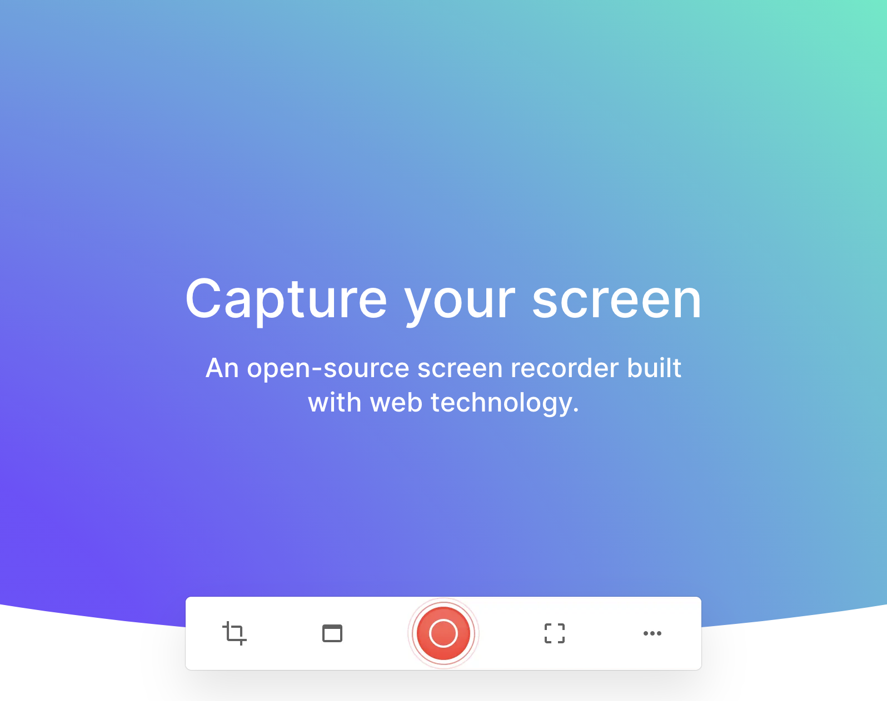
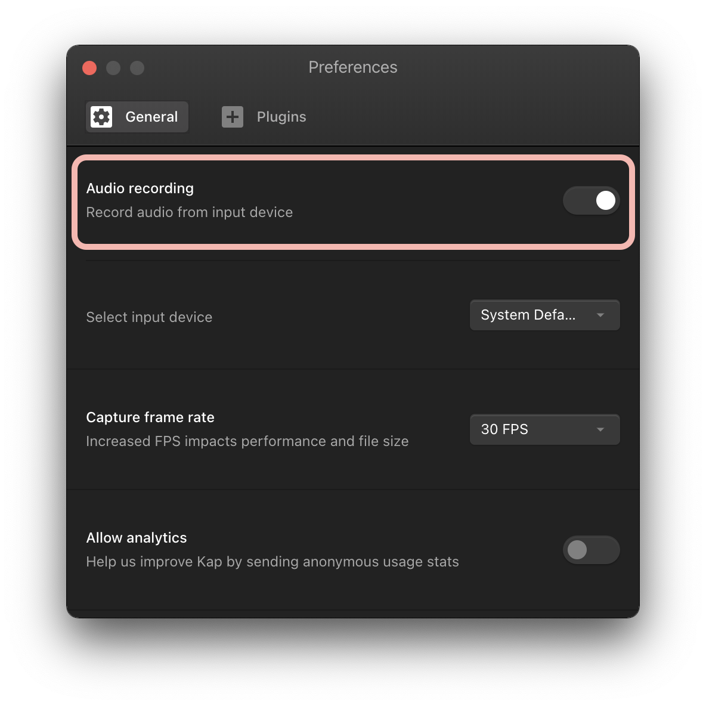
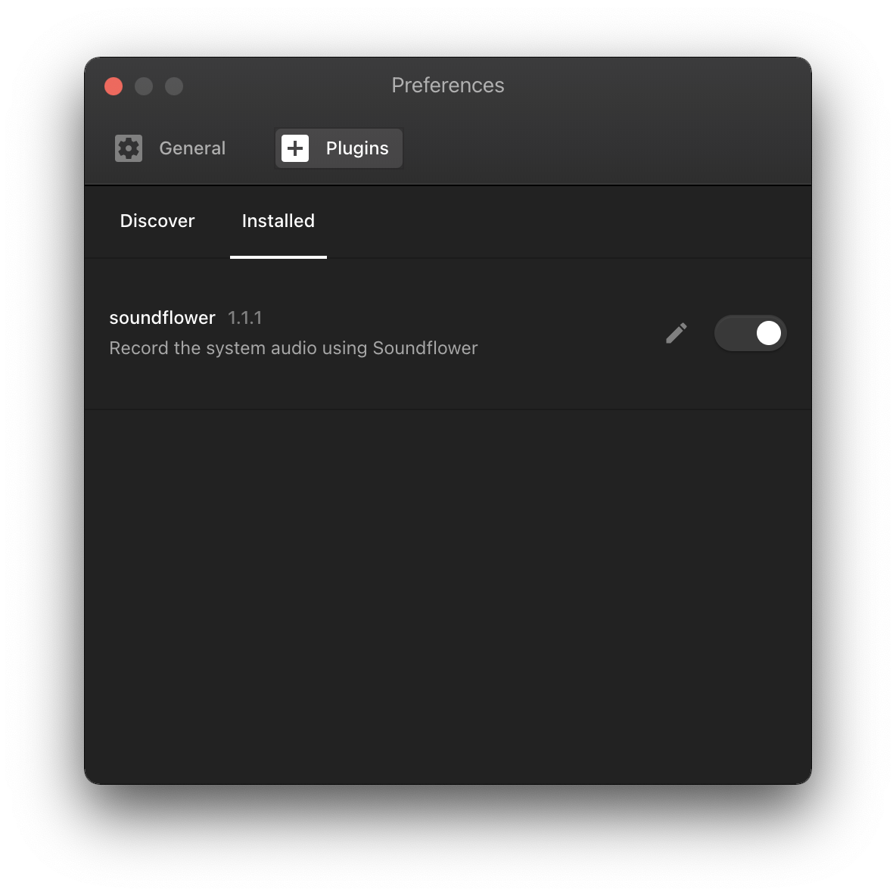

I've been for years a very happy user of [Kap][kap], a free open-source app to record the screen of my MacBook.

Recently I wanted to perform some interviews during a requirements gathering process for a new project at work. I needed a way to record my screen, my voice but also the voice of the interviewee. Essentially I needed to capture:

- Screen
- Audio input
- Audio output

So, as usual, I started with a simple [Google search][google-search] to see what is out there. I found many solutions that required downloading some apps (like [Soundflower][soundflower], [LoopBack][loopback] or [ScreenFlow][screenflow]) and use some of them in combination with Quicktime Player, a native macOS app.

5 minutes had passed and I already felt overwhelmed. I thought this was gonna be easier. And then it hit me: _"Why haven't you checked if Kap can do that?"_. Dah!

> All I literally had to do was to go to the preferences of the app and turn 2 toggles on.

1. Enable **Audio recording** from the General tab
2. Enable the **soundflower plugin** from the Plugins tab

Finito.

[kap]: https://getkap.co/
[google-search]: https://www.google.com/search?q=record+screen+audio+input+and+output+mac&sxsrf=ALeKk03pGfOhM0PDc64SpqsGcRIu_a3Tkw%3A1616781405527&ei=XSBeYLnAH4X0kwXXk4TYDw&oq=record+screen+audio+input+and+output+mac&gs_lcp=Cgdnd3Mtd2l6EAM6BwgAEEcQsANQurYQWLq2EGDGuhBoA3ACeACAAVuIAZ4BkgEBMpgBAKABAaoBB2d3cy13aXrIAQjAAQE&sclient=gws-wiz&ved=0ahUKEwj54uuKxM7vAhUF-qQKHdcJAfsQ4dUDCA0&uact=5
[loopback]: https://rogueamoeba.com/loopback/
[screenflow]: https://www.telestream.net/screenflow/
[soundflower]: https://github.com/mattingalls/Soundflower
