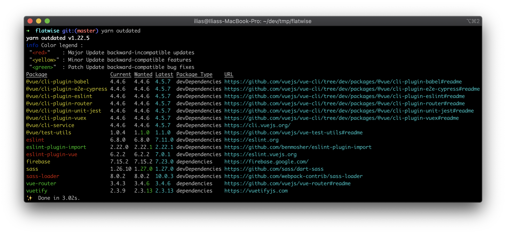
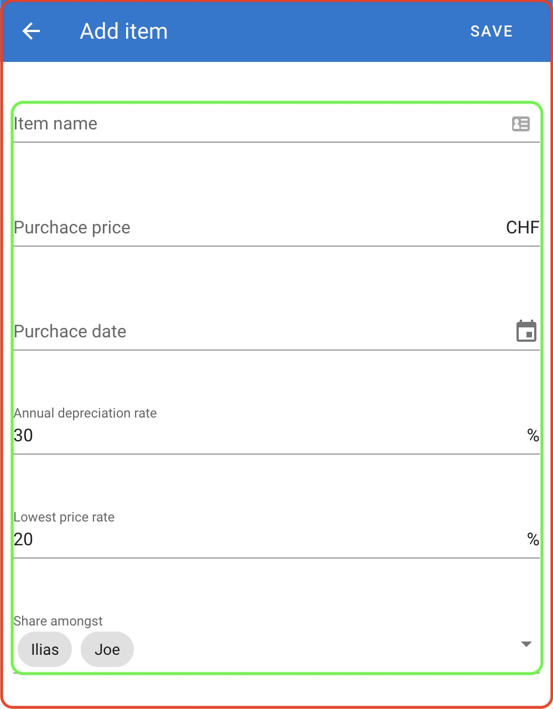

During last summer I was working on a Vue (and Vuex) side-project. I hadn't touched it for almost 2 months due to lack of time and now I finally found the time to work on it again. Naturally, the first thing I do in these cases is to check that all my packages are up to date. Of course, shit loads of things changed these past 2 months in Frontendland :P



After upgrading all my packages I noticed that eslint is complaining about something. Apparently, I was violating the [`vue/no-mutating-props` rule](https://eslint.vuejs.org/rules/no-mutating-props.html) (since I am using the `plugin:vue/essential` eslint plugin) because I am changing the value of a prop passed from a parent component to a child component, within the child component. The [official docs](https://vuejs.org/v2/guide/migration.html#Prop-Mutation-deprecated) declare this as an anti-pattern with the following explanation:

> Due to the new rendering mechanism, whenever the parent component re-renders, the child component’s local changes will be overwritten.

Seems like I haven't thought my component design very thoroughly... Oopsie! Time to fix it.

To give a bit of context, the screen where the error appeared included 2 components:

- `/src/views/ItemAdd.vue` (red box)
- `/src/components/ItemForm.vue` (green box)



and the (simplified) code looked like this:

```html
<!-- /src/views/ItemAdd.vue -->
<template>
  <div>
    <v-toolbar>
      <!-- ... -->
    </v-toolbar>
    <v-main>
      <ItemForm :item="item" />
    </v-main>
  </div>
</template>

<script>
  import ItemForm from "@/components/ItemForm.vue"

  export default {
    components: {
      ItemForm,
    },
    props: ["flatId"],
    data: () => {
      return {
        flat: {},
        item: {
          name: "",
          // ...
        },
      }
    },
    created() {
      this.flat = this.getFlat(this.flatId)
      this.item.name = this.flat.name
      // ...
    },
    methods: {
      // ...
    },
  }
</script>
```

```html
<!-- /src/components/ItemForm.vue -->
<template>
  <v-form>
    <v-text-field v-model="item.name" label="Item name" />
    <!-- ... -->
  </v-form>
</template>

<script>
  export default {
    props: ["item"],
  }
</script>
```

This was working perfectly fine :P The `v-model` was modifying the property passed to the child component and I didn't have to pass it back to the parent component so that it can be saved when clicking the _Save_ button of the parent component's toolbar. But that's a bad pattern.

## How NOT to do it

Since I've been using Vuex, my initial thought to tackle this problem was to use (what else) the central store.

I started by updating the store, adding the new `item` property and creating the necessary `mutations` and `actions`:

```js
// /src/store/index.js
export default new Vuex.Store({
  state: {
    item: {
      name: '',
      // ...
    },
    // ...
  },
  mutations: {
    SET_ITEM_NAME (state, name) {
      state.name = name
    },
    // ...
  },
  actions: {
    setItemName ({ commit }, name) {
      commit('SET_ITEM_NAME', name)
    },
    // ...
  }
}
```

continued by updating the `FormAdd.vue` view component, removing the unnecessary prop and updating the value in the store:

```diff
- <ItemForm :item="item" />
+ <ItemForm />

...

   created () {
     this.flat = this.getFlat(this.flatId)
-    this.item.name = this.flat.name
+    this.$store.dispatch('setItemName', this.flat.name)
   },
```

Finally, updated the `ItemForm.vue` component to remove the prop and update the `v-model` to use the value from the store instead:

```diff
- <v-text-field v-model="item.name" label="Item name" />
+ <v-text-field v-model="name"      label="Item name" />

...

 export default {
   props: [
-    'item',
     'allFlatmates'
   ],
+  computed: {
+    name: {
+      get () {
+        return this.$store.state.item.name
+      },
+      set (value) {
+        this.$store.dispatch('setItemName', value)
+      }
+    },
+  }
```

This solution seems to work initially. I created an item and it worked. Only to realize that the next time I tried to create an item, the form was already initialized with the data I inserted in the previous item. Dah! The store needs to be **reset** after every item creation. Which means I needed to:

- generate the default state of the item and return it through a function
- iterate through every property of the item property stored in the store and deep copy the default values
- create more actions and mutations
- and I haven't even gone into the `FormEdit.vue` view component yet.

Meh...

Using the central store doesn't look like the right way for this use-case.

## How to do it with `v-model`

Taking a step back and considering what options there are for parent-child component communication in Vue, the most obvious that comes to mind is passing the data from the parent to the child using **props** and the other way around with **emitting events**.

But there's a way that combines both of those and that's [custom inputs using `v-model`](https://vuejs.org/v2/guide/components.html#Using-v-model-on-Components).

```html
<ItemForm v-model="item" />
```

is the same as

```html
<ItemForm v-bind:value="item" v-on:input="item = $event" />
```

So all we need to do is replace the prop with a `v-model` in the parent component and make sure we emit an `input` event every time one of the fields of the form changes.

Going back to the `ItemAdd.vue` view component, I updated it replacing the prop with a `v-model`:

```diff
- <ItemForm :item="item" />
+ <ItemForm v-model="item" />
```

Finally, in the `ItemForm.vue` component we need to clone the `value` property into the local data property called `item`, update it whenever there's an input event in the form fields and emit it back to the parent:

```diff
- <v-text-field v-model="item.name" label="Item name" />
+ <v-text-field :value="value.name" @input="nameChanged($event)" label="Item name" />

...

 <script>
 export default {
   props: [
-    'item',
+    'value',
     'allFlatmates'
   ],
   data () {
     return {
+      item: {},
     }
   },
+  watch: {
+    value (newValue) {
+      if (Object.keys(this.item).length === 0 && this.item.constructor === Object) {
+        this.item = newValue
+      }
+    },
+  },
+  created () {
+    this.item = { ...this.value }
+  },
+  methods: {
+    nameChanged ($event) {
+      this.item.name = $event
+      this.$emit('input', this.item)
+    },
+  }
```

In case you are wondering about the watcher, I had to create it because the `value` prop might not yet have a value when the component is created since it has to come asynchronously from an API.

And that's it! So many fewer lines of code, so many fewer things to worry about.

## Conclusion

Even if you are using Vuex for state management in a project, it should not be considered the only way of communicating data amongst components. This use-case demonstrates the simplicity of using Vue's default features.

I hope this post helps somebody!
