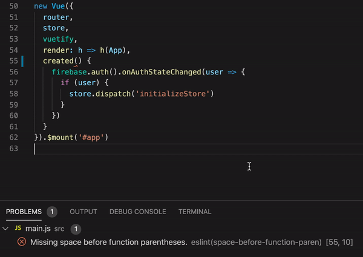

The concept of linters and code formatters is great. What is also great is that formatting errors can be [fixed automatically](https://www.digitalocean.com/community/tutorials/linting-and-formatting-with-eslint-in-vs-code) every time you save a file. However, I find configuring them a pain in the ass.

Today I had to deal with this kind of black magic: I was saving a JS file only to see the formatting errors being fixed and "unfixed" again (the gif below shows what happens when I save the file with `Cmd`+`S`):



After disabling some extensions and checking my VSCode settings, I found the mistake:

```js
"editor.formatOnSave": true,
"editor.codeActionsOnSave": {
    "source.fixAll.eslint": true
},
```

As this [GitHub issue](https://github.com/prettier/prettier-vscode/issues/315) mentions, `editor.formatOnSave` conflicts with `eslint.autoFixOnSave`. Removing the `editor.formatOnSave` setting (or setting it to `false`) fixed the problem:

```js
"editor.formatOnSave": false,
"editor.codeActionsOnSave": {
    "source.fixAll.eslint": true
},
```
