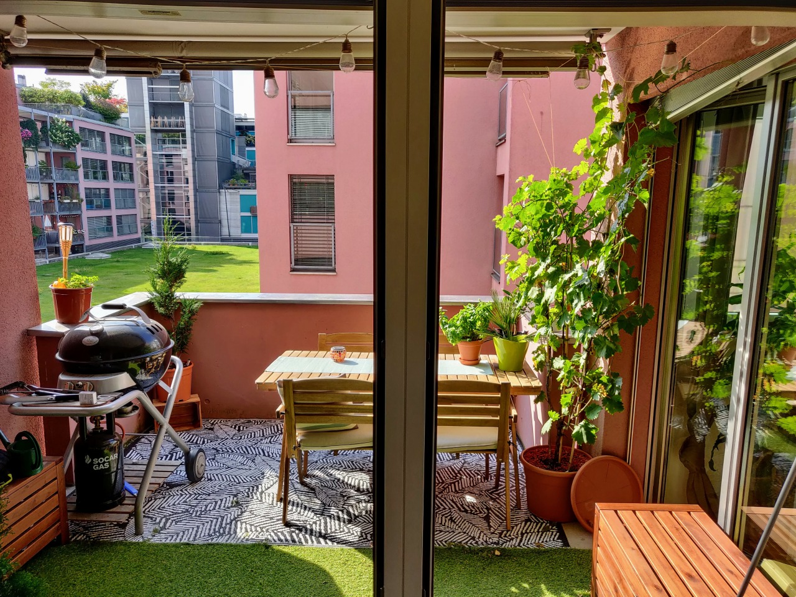

We (Alex - 34; Ilias - 33) are searching for someone to share our beautiful home with! We are looking for a young professional around our age who has lived in a shared flat before. The flat is located in the heart of the industrial district of Zurich.

Since Ilias will be traveling for 5 months starting in November, you will share the flat with Alex and our temporary flatmate Anika during this time. After Ilias returns, it will be Alex, Ilias, and you :)

## The room, the flat, the building

The room is **16m2**, unfurnished, bright, and located on the lower floor of a **duplex 5.5** room apartment that measures **180m2** in total. Alex and Ilias occupy the 2 other rooms and the 4th room is used as a guest room / laundry room. There is also a changing room with 9 door wardrobes (each of us has 3) and 2 bathrooms. You will have your **own bathroom** with a bathtub since Alex and Ilias share the other one.

The upper floor is a large area with an open kitchen & bar, living & dining area and a **12m2 balcony**. There is also a room with a 3rd toilet, a laundry machine and a tumbler.

The building has an approx. **500m2 roof terrace** that is shared amongst the residents. The flat also has a small cellar in the basement of the building. Ilias’ and Alex’s room have access to a commonly shared yard that you can also access at any time. Lastly, Alex has a car that you can borrow if he doesn't need it.

The rent of the room is **1148.-** (we all pay the same rent) which includes heating and water bills. We pay Internet separately in an annual bill of 777.- (21.5 CHF /person/month). The deposit is **2x** the monthly rent. We also ask for a downpayment of approximately 1′070.- CHF which is the depreciated value of all the furniture and equipment we have bought. You will get most of this money back when you move out (we apply a 20% annual depreciation to everything we bought and share).

Ilias and Alex moved in during the summer of 2019. The flat was initially empty and was renovated by us. Since then we put a lot of effort into making it the warm and cozy home that it is today :)

## About us

Alex and Ilias met each other coincidentally while they were both being interviewed for the 2 available rooms in the WG we currently live in. We have a really chill vibe going on in the flat as well as with our neighbors and often plan dinners, outdoor activities, partying and hopefully soon traveling together. In blue (and not so blue) days we often drill into deep discussions about life, the universe and everything.

Let us just depict the life in a normal day in our flat and if you believe you would be a good fit, don't hesitate to contact us.

Ilias wakes up around 7am and spends a couple hours in his room working out, meditating, doing yoga and preparing for the working day. He works as a software engineer from home almost every day and occasionally goes to Neuchatel for work.

Around the same time Alex wakes up too and gets ready for work. He has also discovered the power of morning meditation and kicks off his day with a few quiet minutes. …At least that’s what he tries to do. Sometimes reality hits differently and the morning is introduced by some heated phone calls with his international colleagues. He works as a sourcing manager, also from home, with occasional business trips abroad.

Whenever either of us leaves the flat, we like to leave our room door open. It makes it easier knowing who's at home and who's not. We like our open door policy and when we close our doors it usually means "do not disturb".

Every day either or both of us make sure our little jungle that we are very proud of is properly watered.

At the end of the day you will find Alex working while listening to mellow electronic music encouraging him to finish his work day. Most probably you will find Ilias listening to some techno music and working on his laptop building his apps, reading a book or mixing electronic music on his newly bought DJ controller. We'll both cook (most of the time separately since Alex is intolerant of so many things) and enjoy the rest of the evening listening to music and working on our own things. Occasionally we might play a round of chess and drink some gin tonic together or grill.

During weekends when the weather is good Alex is always outside doing sports like mountain biking, wakeboarding or hiking in the summer and skiing in the winter. Ilias is definitely not as active as Alex, but also enjoys hikes, snowboarding and clubbing!

Anika is working in the engineering industry and usually spends the workdays in the office. She enjoys sports or cozy evenings at home but is always down for a party!

Twice a month we book a cleaning service from Batmaid that takes care of the important things in the common areas. That of course doesn't mean that we don't clean common areas ourselves when needed ;)

We are all tech-savvy, so we like to communicate over our WhatsApp group, share our bills over SplitWise and use a common calendar to inform each other when we have visitors or when we're on holidays.

Of course, as humans, we have our faults and we try to improve. Sometimes Alex is a grumpy cat after work and he needs his space. Ilias might annoy everyone with his techno bass, but he’ll listen once you tell him to put the volume down or wear headphones :)

So, if you are interested, please send us an email at **such.wg.much.cool@gmail.com** and tell us a few things about yourself. We will get back to you when we can to arrange a visit!

